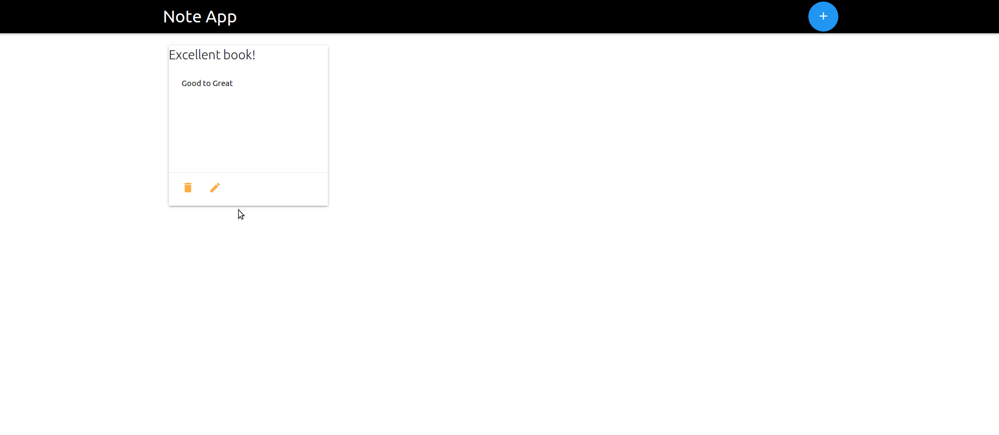

# Note App
A simple SPA (Single Page Application) used to take notes.

#### 1. Requirements
- [Node.js](https://nodejs.org)
- [MongoDB](https://mongodb.com)
#### 2. Installing
Open a terminal and run the following commands.

- `git clone https://github.com/dkreider/note-web-app.git`
- `cd note-web-app/`
- `npm install`
- `node index.js`

Open a browser and visit [http://localhost:3000](http://localhost:3000).